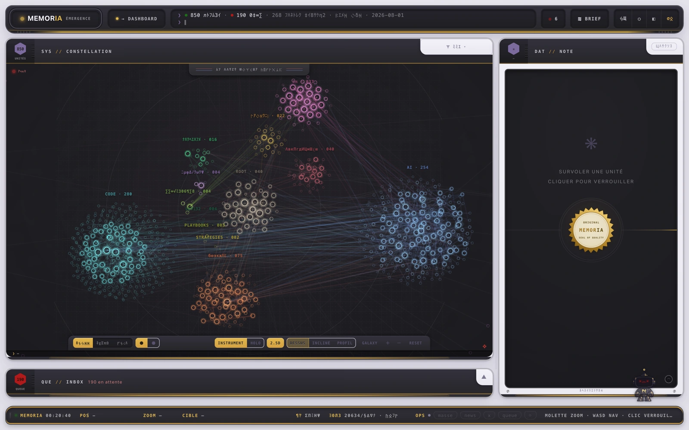
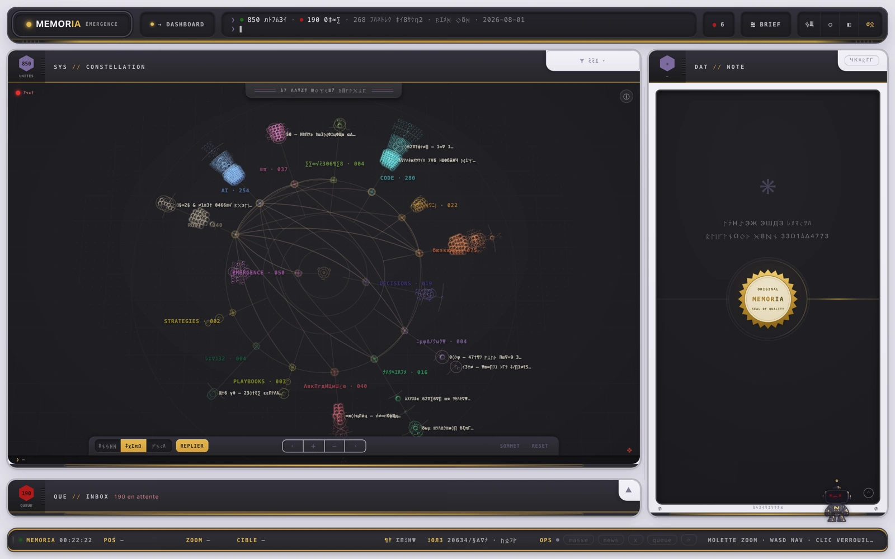
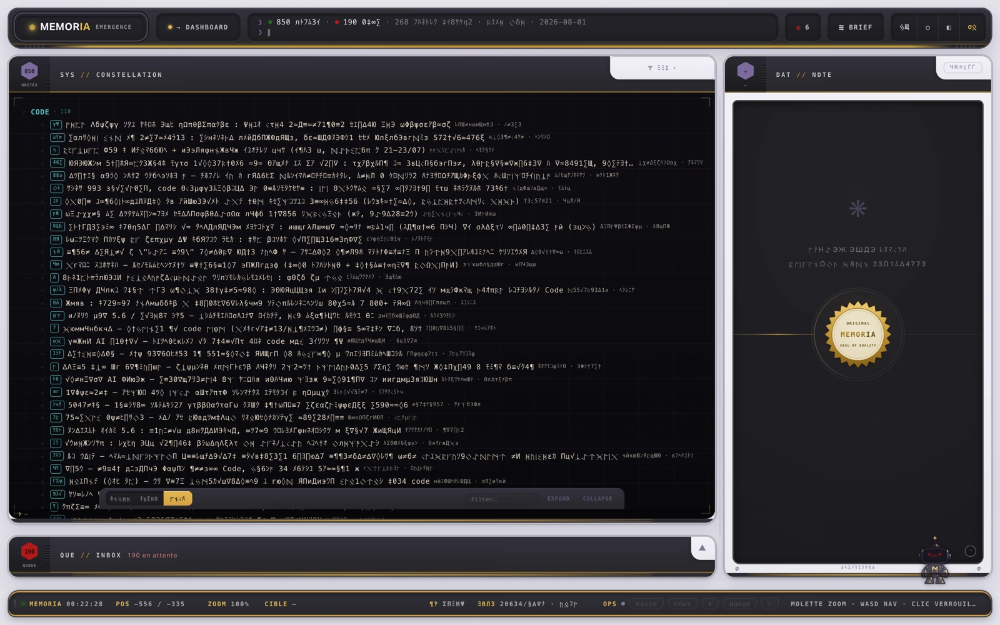
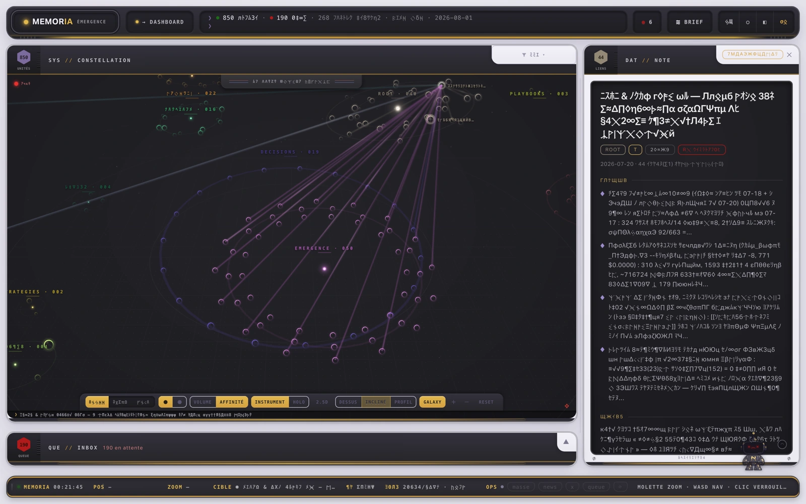
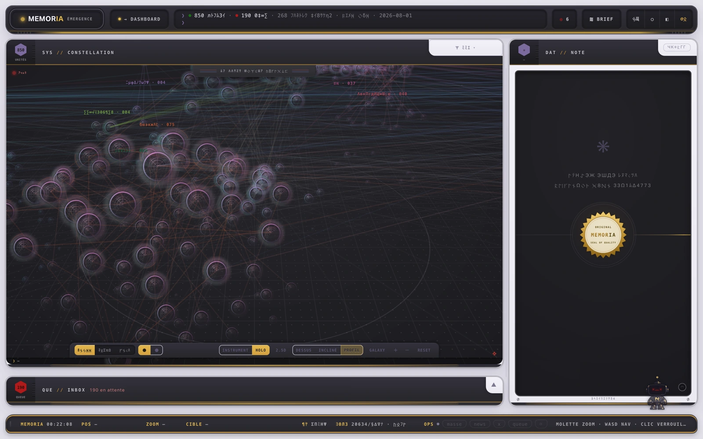
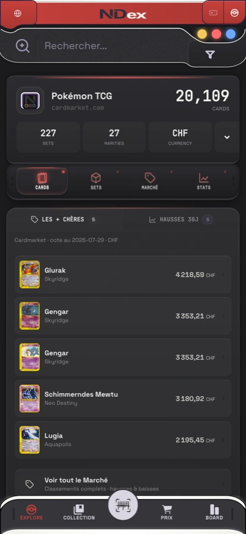
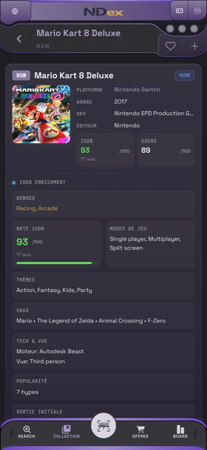

# assayer

**A local knowledge base your agents can read, and the engines that keep it
honest.** Notes in, structure out: computed themes, measured links, bounded
context packs served over MCP. Embeddings, but no vector database — the store
of record is a git tree, and every index is derived from it.


*Screenshots show the live corpus, text scrambled, layout held to ±20 % —
`demo_guard.py` destroys content, not geometry.*

---

## What it does

| | |
|---|---|
| **Reads your vault** | Markdown under version control. No import, no database, no lock-in. |
| **Serves agents** | 4 read-only MCP tools, cold start under 2 s. Budgeted context packs, not raw dumps. |
| **Finds across domains** | BM25 + dense fused retrieval, 1,010 notes indexed, rebuilt when the corpus outruns it (>20 new notes). |
| **Proposes connections** | millions of candidate pairs filtered by arithmetic alone; a model is called only on the surviving fraction of a percent, one call each. |
| **Watches itself** | 25 published claims replayed against live evidence, 10 model-free health probes. A figure that drifts *favourably* still fails. |

## The engines

An engine nothing triggers is an engine that does not exist — so each row names
its trigger and its reader.

| Engine | What it does | Trigger | Read by |
|---|---|---|---|
| **Vault server** | 4 read-only MCP tools | agent request | agents |
| **Hybrid retriever** | BM25 + dense RRF, 384-dim | every search | agents |
| **Index refresh** | rebuilds when >20 notes outrun the index; silent when idle | end of ingestion | the retriever |
| **Cross-theme probe** | pairs candidates across themes, arithmetic only, $0 | manual — its scheduler ships unarmed | its report |
| **Articulator** | writes *why* two paired notes connect — or refuses | per candidate | the human verdict |
| **Bridge writer** | the only writer into the bridge layer | manual | the corpus |
| **Health loop** | 10 probes, 0 models, one JSON state file | daily | notification on change |
| **Claims guard** | replays every published claim against live evidence | daily probe + every publish | this page |
| **Tracker** | derives pipeline and subject state from sources that already exist | end of ingestion; hourly with the hub | *where does X stand* |

```
python3 contenu/scripts/emergence_doctor.py --verbose
python3 contenu/scripts/claims_guard.py
python3 contenu/scripts/tracker.py
```

## Three projections, one corpus

The map answers *where does this sit*, the radial view *what hangs off what*,
the list *what changed*. Theme height is maturity, not size — four tiers from
inbox to validated synthesis.

| Constellation | Radial | List |
|---|---|---|
|  |  |  |

| The galaxy under affinity — each theme orbits the one it over-connects with | Hologram material, close in |
|---|---|
|  |  |

## Retrieval, measured

On the frozen 24-question benchmark, plain tokenized `grep` reaches
**hit@4 = 0.750**. The hybrid arm reaches **0.875** — and no arm separates
from `grep` at p < 0.05. That figure argues *against* the retrieval work on
this page, and it stays here because it decides whether the embeddings earn
their cost.

What the benchmark does support is narrower: the dense arm does not rank
better, it **finds what BM25 misses**. Union recall@10 is 0.775 against 0.550
for BM25 alone. Coverage is the argument for the fused path; ranking is not —
and at 24 questions, the smallest representable difference is 4 points, so no
gap below that is a gap.

→ [Full scorecard, with its ceilings and exclusions](docs/retrieval.md)

## The guards

Four guards block; a fifth audits. They are code, and the code is tested —
**1,063 tests pass** (measured 2026-08-07): the full four-root suite in CI,
while `pre-push` always runs three roots and adds the fourth when the push
touches it.

| Guard | Does |
|---|---|
| Destructive-bash hook | blocks `rm -rf` outside one allowed path; SQL `DROP`/`TRUNCATE`/`DELETE` with no `WHERE` |
| Model hook | blocks any agent spawn without an explicit model from a fixed allowlist |
| `pre-commit` | blocks protocol drift, compared by normalized identity |
| `pre-push` | blocks red tests — nothing leaves the machine over a failing suite |
| Schema hook | audits vault writes after the fact — an append-only violation log, not a door |

Where a backlog is too large to fix at once, the dead-reference guard
ratchets instead of counting: the count may not rise, and the ceiling lowers
itself when repairs land. The test count has a hard floor rather than a
ratchet.

## The corpus

| | | Command |
|---|---|---|
| Canonical notes / translations | 1,036 / 367 (2026-08-07 — ingestion moves it daily) | `claims_checks/canonical_split.py` |
| Notes failing a real YAML parse | 0 | `claims_checks/schema_gap_pct.py 0 0.5` |
| Cross-theme links | 276 | `claims_checks/cross_theme_links.py` |

One note per idea, any number of languages. A translation carries a hash of
its source, regenerates when the source moves, and stays out of the graph and
out of every count. Everything else — vectors, lexical index, thematic graph,
rendered hub — is derived and deletable: an index that cannot be regenerated
becomes a second source of truth, which makes it the next thing to lie.

## What is not running

- The bridge chain's paid stage is manual, and stays manual while the human
  verdict queue is the bottleneck — scheduling a billed stage into a queue
  nobody drains is how you pay for a backlog.
- The bridge chain's scheduler ships as a file, not armed: arming a daemon is
  a persistent change to someone's machine.

## Verify it

The claims register — [`claims.json`](claims.json), regenerated at publish —
replays the published figures against live evidence rather than a stored copy
of the answer. Bounds run in both directions: a figure that drifts
favourably is still stale, and still fails.

## Where it came from

Extracted from a shipped product: [NDEX](https://nd-x.app), a Swiss price
index for retro games and Pokémon cards, computed from completed sales rather
than asking prices. Matching a noisy listing to a catalogue is the same
problem as deciding what a note is about — resolve an ambiguous string to a
known entity, keep a confidence you can defend, publish the number with the
command that produces it.

| Retro games | Pokémon cards | A single listing |
|---|---|---|
|  |  |  |

They also share a design language — a UI that behaves like a device, not like
paper — extracted and published as
[retromorphism](https://github.com/Yyunozor/retromorphism). NDEX's public
landing closes on a *built with assayer* seal; the loop runs in both
directions.

## Status

Early. Not packaged for install. Upstream PRs open on
[Graphify](https://github.com/Graphify-Labs/graphify). Issues welcome —
especially on the measurements.
