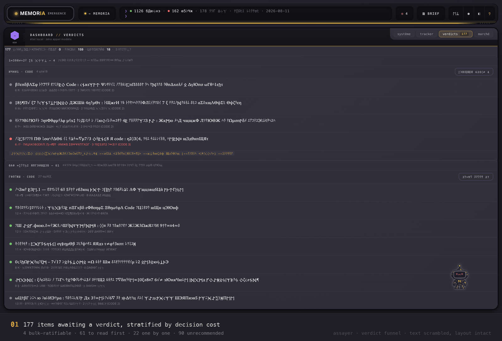

# assayer

**A local knowledge base your agents can read, and the engines that keep it
honest.** Notes in, structure out: computed themes, measured links, bounded
context packs served over MCP. Embeddings, but no vector database — the store
of record is a git tree, and every index is derived from it.


*Screenshots show the live corpus, text scrambled, layout held to ±20 % —
`demo_guard.py` destroys content, not geometry.*

---

## What it does

| | |
|---|---|
| **Reads your vault** | Markdown under version control. No import, no database, no lock-in. |
| **Serves agents** | 4 read-only MCP tools; a cold process answers its first search in ~1.6 s on a 1,600-note vault (median of 7, 2026-08-12). Budgeted context packs, not raw dumps. |
| **Finds across domains** | BM25 + dense fused retrieval, 1,492 notes indexed (2026-08-20), rebuilt when the corpus outruns it (>20 new notes). |
| **Proposes connections** | millions of candidate pairs filtered by arithmetic alone; a model is called only on the surviving fraction of a percent, one call each. |
| **Evaluates at birth** | every incoming note is scored against the owner's *workstreams* and open questions: `pour:` (addressees, closed vocabulary), `actionnable:` (one action line), `signal` when it answers an open question, `etincelle` for real singularities with no addressee. |
| **Drains its own queue** | a verdict funnel: mechanical triage for free, batch LLM recommendations with a hash cache, and one human command to ratify in bulk. The machine recommends; only a human gesture writes. |
| **Watches itself** | 31 published claims replayed against live evidence, 11 model-free health probes. A figure that drifts *favourably* still fails. |

## The engines

An engine nothing triggers is an engine that does not exist — so each row names
its trigger and its reader.

| Engine | What it does | Trigger | Read by |
|---|---|---|---|
| **Vault server** | 4 read-only MCP tools | agent request | agents |
| **Hybrid retriever** | BM25 + dense RRF, 384-dim | every search | agents |
| **Index refresh** | rebuilds when >20 notes outrun the index; silent when idle | end of ingestion | the retriever |
| **Cross-theme probe** | pairs candidates across themes, arithmetic only, $0 | manual — its scheduler ships unarmed | its report |
| **Articulator** | writes *why* two paired notes connect — or refuses | per candidate | the human verdict |
| **Bridge writer** | the only writer into the bridge layer | manual | the corpus |
| **Directed evaluation** | scores each new note against workstreams + open questions | every ingestion | the verdict funnel |
| **Verdict funnel** | triage ($0) → batch recommendations (cached) → bulk human ratification | manual | the human queue |
| **Health loop** | 11 probes, 0 models, one JSON state file | daily | notification on change |
| **Claims guard** | replays every published claim against live evidence | daily probe + every publish | this page |
| **Tracker** | derives pipeline and subject state from sources that already exist | end of ingestion; hourly with the hub | *where does X stand* |

```
python3 contenu/scripts/emergence_doctor.py --verbose
python3 contenu/scripts/claims_guard.py
python3 contenu/scripts/tracker.py
```

## Two projections, one corpus

The map answers *where does this sit*, the list *what changed*. Theme height is
maturity, not size — four tiers from inbox to validated synthesis.

| Constellation | List |
|---|---|
|  |  |

| The galaxy under affinity — each theme orbits the one it over-connects with | Hologram material, close in |
|---|---|
|  |  |

## Retrieval, measured

On the frozen 24-question benchmark, plain tokenized `grep` reaches
**hit@4 = 0.750**. The hybrid arm reaches **0.875** — and no arm separates
from `grep` at p < 0.05. That figure argues *against* the retrieval work on
this page, and it stays here because it decides whether the embeddings earn
their cost.

What the benchmark does support is narrower: the dense arm does not rank
better, it **finds what BM25 misses**. Union recall@10 is 0.775 against 0.550
for BM25 alone. Coverage is the argument for the fused path; ranking is not —
and at 24 questions, the smallest representable difference is 4 points, so no
gap below that is a gap.

→ [Full scorecard, with its ceilings and exclusions](docs/retrieval.md)

## The guards

Four guards block; a fifth audits. They are code, and the code is tested —
**1,864 tests pass** (measured 2026-08-12): the full four-root suite in CI,
while `pre-push` always runs three roots and adds the fourth when the push
touches it.

| Guard | Does |
|---|---|
| Destructive-bash hook | blocks `rm -rf` outside one allowed path; SQL `DROP`/`TRUNCATE`/`DELETE` with no `WHERE` |
| Model hook | blocks any agent spawn without an explicit model from a fixed allowlist |
| `pre-commit` | blocks protocol drift, compared by normalized identity |
| `pre-push` | blocks red tests — nothing leaves the machine over a failing suite |
| Schema hook | audits vault writes after the fact — an append-only violation log, not a door |

Where a backlog is too large to fix at once, the dead-reference guard
ratchets instead of counting: the count may not rise, and the ceiling lowers
itself when repairs land. The test count has a hard floor rather than a
ratchet.

## The verdict funnel

A knowledge base that only accumulates is a backlog with a search bar. Notes
enter already scored against the owner's workstreams — a closed vocabulary,
with `QUESTIONS-OUVERTES.md` as the per-user compass injected into every
ingestion prompt. What still needs judgement goes through a funnel:

1. **Triage, free** — notes younger than five days stay out (the synthesis
   engine gets ~20 chances to absorb them first); durable singletons move on;
   `etincelle`-tagged notes are exempt by construction.
2. **Recommendation, batched** — twelve notes per model call, titles and
   claims only, a byte-hash cache so an unchanged note is never paid twice,
   a hard cost ceiling.
3. **Ratification, human** — one command applies a whole confidence tier,
   item by item through the single journalled write path. Dry-run by
   default; a repo-wide test proves no pipeline can ever invoke it.

Two views in four beats — the queue by decision cost, the same queue further
down with one table per theme, the dry-run of a 27-note batch, and the confirm
button that dry-run puts under your cursor.

| The funnel, live |
|---|
|  |

Run for real on 2026-08-10: two commands ratified 122 recommendations — 98
kept, 24 archived, 0 skipped, each written item by item through the journalled
path — taking the queue from 273 to 151 that day, a snapshot rather than
today's count: ingestion refills the queue continuously. The 223
recommendations behind them cost $7.94 over four runs: 3.6 cents a note, paid
once.

The machine recommends. Only a human gesture writes — that rule is enforced
by code and attacked in review, not stated in a wiki.

→ [Thresholds, cost bounds and the five hard rules](docs/funnel.md) ·
[the reading surface upstream of it](docs/brief.md)

## The corpus

| | | Command |
|---|---|---|
| Canonical notes / translations | 1,376 / 540 (2026-08-18 — ingestion moves it daily) | `claims_checks/canonical_split.py` |
| Notes failing a real YAML parse | 1 of 1,917 (0.1 %, 2026-08-18) | `claims_checks/schema_gap_pct.py 0 0.5` |
| Cross-theme links | 280 | `claims_checks/cross_theme_links.py` |

One note per idea, any number of languages. A translation carries a hash of
its source, regenerates when the source moves, and stays out of the graph and
out of every count. Everything else — vectors, lexical index, thematic graph,
rendered hub — is derived and deletable: an index that cannot be regenerated
becomes a second source of truth, which makes it the next thing to lie.

## What is not running

- The bridge chain's paid stage is manual, and stays manual while the human
  verdict queue is the bottleneck — scheduling a billed stage into a queue
  nobody drains is how you pay for a backlog.
- The bridge chain's scheduler ships as a file, not armed: arming a daemon is
  a persistent change to someone's machine.

## Verify it

The claims register — [`claims.json`](claims.json), regenerated at publish —
replays the published figures against live evidence rather than a stored copy
of the answer. Bounds run in both directions: a figure that drifts
favourably is still stale, and still fails.

## Where it came from

Extracted from a shipped product: [NDEX](https://nd-x.app), a Swiss price
index for retro games and Pokémon cards, computed from completed sales rather
than asking prices. Matching a noisy listing to a catalogue is the same
problem as deciding what a note is about — resolve an ambiguous string to a
known entity, keep a confidence you can defend, publish the number with the
command that produces it.

| Retro games | Pokémon cards | A single listing |
|---|---|---|
|  |  |  |

They also share a design language — a UI that behaves like a device, not like
paper — extracted and published as
[retromorphism](https://github.com/Yyunozor/retromorphism). NDEX's public
landing closes on a *built with assayer* seal; the loop runs in both
directions.

## Status

**The vault server runs here, over MCP, against this corpus — it is not
packaged for anyone else yet.** Ingestion, the verdict funnel and the bridge
chain stay in the source tree by design: they call a model, cost money per run,
and are scored against one owner's workstreams. The reading surface is the one
piece that could travel, and it stays here until we are certain of it — an
install line is a promise about someone else's machine.

Still early everywhere else. Upstream PRs open on
[Graphify](https://github.com/Graphify-Labs/graphify). Issues welcome —
especially on the measurements.
